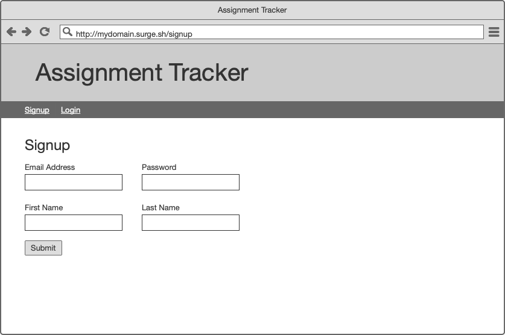
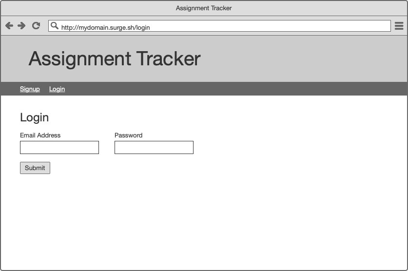
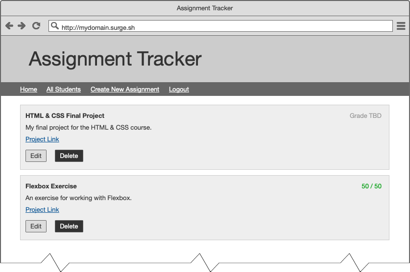

# Final Project

This is the final project for the JSCRIPT 400, Backend Web Development Course.

## Project Links

Please fill in these links once you have completed the project. If you need help writing Markdown, you can refer to [this document](https://github.com/adam-p/markdown-here/wiki/Markdown-Cheatsheet).

* [Frontend Repository]()
* [Backend Repository]()
* [Deployed Frontend]()

## Project Checklist

This checklist is meant to be a useful guide for you in determining what you have left to do.

- [ ] I have added my Frontend Repository link above
- [ ] I have added my Backend Repository link above
- [ ] I have completed the requirements of the [Signup](#Signup) page
- [ ] I have completed the requirements of the [Login](#Login) page
- [ ] I have completed the requirements of the [Home (Student View)](#Home-Student-View) page
- [ ] I have completed the requirements of the [All Students (Student View)](#All-Students-Student-View) page
- [ ] I have completed the requirements of the [Create New Assignment](#Create-New-Assignment) page
- [ ] I have completed the requirements of the [Edit Assignment](#Edit-Assignment) page
- [ ] I have completed the requirements of the [All Students (Admin View)](#All-Students-Admin-View) page
- [ ] I have completed the requirements of the [Ungraded Assignments](#Ungraded-Assignments) page
- [ ] I have completed the requirements of the [Graded Assignments](#Graded-Assignments) page
- [ ] I have completed the requirements of the [Logout](#Logout) page
- [ ] I have added my Deployed Frontend link above
- [ ] I have removed any commented out code from both of my repositories
- [ ] I have submitted my project on Canvas
- [ ] I have created 10 or more students on my deployed site
- [ ] I have created at least one assignment for each student on my deployed site
- [ ] I have created a student user with the email `student@email.com` and the password `password` and have tested logging in with it
- [ ] I have created an admin user with the email `admin@email.com` and the password `password` and have tested logging in with it

## Goal

The goal of this project is to demonstrate your capabilities with the following learning objectives:

* Create an application server using NodeJS and Express
* Identify and create RESTful APIs
* Interact with a document database
* Implement a basic authentication setup using JSON web tokens
* Communicate with an application server using a front-end client

## General Project Details

Please carefully note the following:

* While you may work on this project with your classmates, _all code you write must be your own._
* Please follow the instructions carefully! Incorrectly submitted projects will not be considered. Ask questions if something is unclear.
* This project is due the **Friday after our last class**.

## File Structure & Code Requirements

It is up to you how you want to structure both the frontend and the backend. Please just keep in mind the following:

* You must use languages, tools, and frameworks we've discussed in class for the backend. Specifically, your project must make use of Node, Express, MongoDB, and Mongoose.
* You may _not_ use a different type of framework or generator.
* Your deployed application _must_ have at least 10 students and one instructor. Each student must have at least one assignment. Consider seeding data!
* You _must_ have a student user with the following credentials:
  ```
  email: student@email.com
  password: password
  ```
* You _must_ have an admin user with the following credentials:
  ```
  email: admin@email.com
  password: password
  ```

## Project Description

For the Final Project, you will be building a simple grading tool. The goal of the application is for students to submit assignments and for instructors to be able to provide grades for those assignments. The features you will need to build are listed out here with mockups to give a sense of what it should look like. Please note, it is not important to have the visual design match the mockups. These are simply examples.

### Signup



As a user, I should be able to signup for the application. The form should allow for me to enter an email, password, first name, and last name.

.png)

If there are errors, users should be shown what the problem is. The following validations should be in place:

* Email Address is required **and** must be a valid email
* Password is required **and** must be at least 8 characters
* First Name is required
* Last Name is required

### Login



As a user, I should be able to login to the application. The form should allow for me to enter an email and password.

.png)

If there are errors, users should be shown what the problem is. If the user cannot be logged in, they should be shown a generic error message describing the authentication problem.

### Home (Student View)



As a student user, I should see a navigation bar and a list of my assignments after I have successfully logged in to the application. I should see the same page if I click on the "Home" link. Each assignment will include basic information about the assignment and a grade, if any.

.png)

As a student user, if I click the delete button, the assignment should be deleted and a message should show on the screen confirming the deletion. The assignment should then be removing from the page.

### All Students (Student View)


As a student user, if I click the "All Students" link, I should be shown a page with all of my fellow students and their email addresses.

### Create New Assignment


As a student user, if I click the "Create New Assignment" link, I should be shown a form. In this form, I can enter an Assignment Title, a Project Link, and a Project Description. After successfully creating an assignment, I should be brought back to the "Home" page.

.png)

If there are errors, users should be shown what the problem is. All fields are required.

### Edit Assignment


As a student user, if I click the "Edit" button on an existing assignment from my "Home" page, I should be shown a form with the assignment's information inputted into it. After successfully editing an assignment, I should be brought back to the "Home" page.

.png)

If there are errors, users should be shown what the problem is. All fields are required.

### All Students (Admin View)

.png)

As an admin user, after I've logged in I should be brought to the "All Students" page. The navigation bar will have different links and I should see a message in the corner that welcomes me (the content of this message is unimportant). For the admin's "All Student" page, they should be able to the same information a student sees as well as an overall total for the student's grade. The grades should be color-coded to show generally how the student is doing; for example, students with an average score of 90% or higher have their score highlighted in a different color (the actual mechanics of this are unimportant).

.png)

Admin users should also be able to filter students based on their scores. Admin users should be able to ask for scores below a certain amount, above a certain amount, or both.

### Ungraded Assignments

As a student user, I should not be able to access this page. If I do, I should be sent back to my "Home" page.

.png)

As an admin, when I click on the "Ungraded Assignments" link I should be shown a page with all assignments from all students which do not currently have a grade. I should see the standard information for the assignment but should also be able to enter in two values: the score and what the score is out of. When clicking "Save" on an individual assignment, the score should be saved and that assignment should be removed from the list.

### Graded Assignments

As a student user, I should not be able to access this page. If I do, I should be sent back to my "Home" page.

.png)

As an admin, when I click on the "Graded Assignments" link I should be shown a page with all assignments from all students which currently have a grade. I should see the standard information for the assignment but should also see the previous grade that was given entered into two inputs. If I change those values and click "Save" on an individual assignment, the score should be updated.

### Logout

When a user is logged out, that should be returned to the "Login" page.